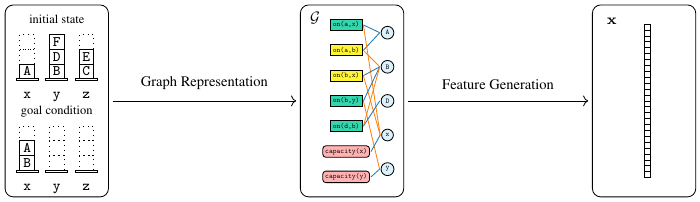

WLPlan
======

[](https://pypi.org/project/wlplan/)
[](LICENSE)

WLPlan is a package for generating embeddings of PDDL planning problems for machine learning tasks. It supports both classical and numeric planning problems.

<p align="center">
    
</p>

## Installation
### Python Interface
The Python interface can be installed simply with

    pip install wlplan

The PyPI release only supports `python>=3.10`. Alternatively, you can also install the package from the source code with the `install.sh` script.

### C++ Interface
The C++ interface can be installed in your project by running

    ./cmake_build.py <path/to/installation>

and adding the following to the root CMakeLists.txt file of your project

    list(APPEND CMAKE_PREFIX_PATH "<path/to/installation>")
    find_package(wlplan)
    ...
    target_link_libraries(<your_project> PRIVATE wlplan)

## Usage
Examples for how to use the package include this self-contained [notebook](docs/examples/blocksworld.ipynb) and [test](tests/test_train_eval_blocks.py), as well as the [GOOSE](https://github.com/DillonZChen/goose) framework.

### Hyperparameters
Further details of available hyperparameters are summarised in the ECAI'25 publication accessible [here](https://arxiv.org/abs/2508.18515).

#### Graph Representations
The graph representations of planning tasks implemented thus far are listed as follows.
| Name                                          | WLPlan shorthand | Description                                                     | Reference                                                                                                                            |
| --------------------------------------------- | ---------------- | --------------------------------------------------------------- | ------------------------------------------------------------------------------------------------------------------------------------ |
| Instance Learning Graph (ILG)                 | `ilg`            | Atoms and objects as nodes, with object instantiations as edges | D. Z. Chen, F. Trevizan, S. Thiébaux:  Return to Tradition: Learning Reliable Heuristics with Classical Machine Learning. ICAPS 2024 |
| Numeric Instance Learning Graph (νILG)        | `nilg`           | ILG for numeric planning problems                               | D. Z. Chen, S. Thiébaux:  Graph Learning for Numeric Planning. NeurIPS 2024                                                          |
| Planning with Object Importance Graph (PLOIG) | `ploig`          | Objects as nodes, and atoms as edges                            | D. Z. Chen, S. Thiébaux:  Graph Learning for Numeric Planning. NeurIPS 2024                                                          |

#### Feature Generators
The feature generators implemented thus far are listed as follows.
| Name                             | WLPlan shorthand | Reference                                                                                                                       |
| -------------------------------- | ---------------- | ------------------------------------------------------------------------------------------------------------------------------- |
| Relational Weisfeiler-Leman (WL) | `wl`             | P. Barceló, M. Galkin, C. Morris, M. A. Romero Orth: Weisfeiler and Leman Go Relational. LoG 2022                               |
| 2-WL                             | `kwl2`           | J. Cai, M. Fürer, N. Immerman: An optimal lower bound on the number of variables for graph identification. Combinatorica (1992) |
| Local 2-WL (2-LWL)               | `lwl2`           | C. Morris, K. Kersting, P. Mutzel: Glocalized Weisfeiler-Lehman Graph Kernels: Global-Local Feature Maps of Graphs. ICDM 2017   |
| Continuous-Categorical WL (ccWL) | `ccwl`           | D. Z. Chen, S. Thiébaux: Graph Learning for Numeric Planning. NeurIPS 2024                                                      |
| individualised WL (iWL)          | `iwl`            | D. Z. Chen: Weisfeiler-Leman Features for Planning: A 1,000,000 Sample Size Hyperparameter Study. ECAI 2025                     |
| normalised iWL (niWL)            | `niwl`           | D. Z. Chen: Weisfeiler-Leman Features for Planning: A 1,000,000 Sample Size Hyperparameter Study. ECAI 2025                     |

## References
### Academic Publications
Some academic publications which use WLPlan are listed as follows.
- Dillon Z. Chen. **Symmetry-Invariant Novelty Heuristics via Unsupervised Weisfeiler-Leman Features**. In ICAPS 2025 Workshop on Heuristics and Search for Domain-independent Planning (HSDIP), 2025. 
- Dillon Z. Chen. **Weisfeiler-Leman Features for Planning: A 1,000,000 Sample Size Hyperparameter Study**. In 28th European Conference on Artificial Intelligence (ECAI), 2025. 
- Mingyu Hao, Dillon Z. Chen, Felipe Trevizan, and Sylvie Thiébaux. **Effective Data Generation and Feature Selection in Learning for Planning**. In 28th European Conference on Artificial Intelligence (ECAI), 2025. 
- Rebecca Eifler, Nika Beriachvili, Arthur Bit-Monnot, Dillon Z. Chen, Jan Eisenhut, Jörg Hoffmann, Sylvie Thiébaux, and Florent Teichteil-Königsbuch. **An Operator-Centric Trustable Decision-Making Tool for Planning Ground Logistic Operations of Beluga Aircraft**. In 28th European Conference on Artificial Intelligence (ECAI), 2025. 
- Dillon Z. Chen and Sylvie Thiébaux. **Graph Learning for Numeric Planning**. In 38th Conference on Neural Information Processing Systems (NeurIPS), 2024. 
- Dillon Z. Chen, Felipe Trevizan, and Sylvie Thiébaux. **Return to Tradition: Learning Reliable Heuristics with Classical Machine Learning**. In 34th International Conference on Automated Planning and Scheduling (ICAPS), 2024. 

### Bibtex
The academic reference for WLPlan is given by the bibtex entry
```
@article{chen-wlplan-2024,
  author       = {Dillon Z. Chen},
  title        = {WLPlan: Relational Features for Symbolic Planning},
  journal      = {CoRR},
  volume       = {abs/2411.00577},
  year         = {2024},
}
```
