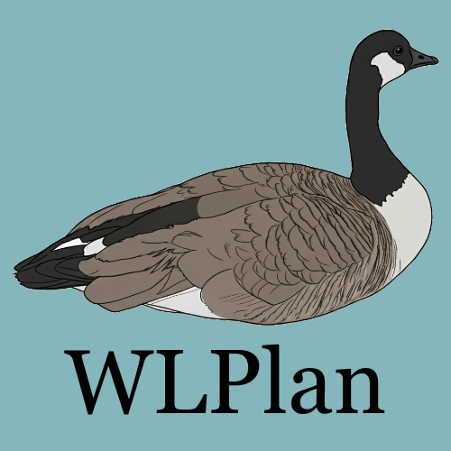

<p align="center">
    
</p>

------

WLPlan
======

[](https://pypi.org/project/wlplan/)
[](https://github.com/DillonZChen/wlplan/LICENSE)

<p class="flex-wrapper">Plan is a library for generating graph representations and feature embeddings of PDDL planning problems and states for machine learning tasks. WLPlan currently supports both classical and numeric planning problems.</p>

The main pipeline in WLPlan consists of (1) converting planning problems and states into graphs, and (2) synthesising feature embeddings by running a variant of the Weisfeiler-Leman (WL) algorithm on the resulting graph.

<p align="center">
    
</p>

Detailed documentation for WLPlan can be found in the official website available [here](https://dillonzchen.github.io/wlplan).

## Installation
### Python Interface
The Python interface can be installed simply with

    pip install wlplan

The PyPI release only supports `python>=3.10`. Alternatively, you can also install the package from the source code with the `install.sh` script.

### C++ Interface
The C++ interface can be installed in your project by running

    ./cmake_build.py <path/to/installation>

and adding the following to the root CMakeLists.txt file of your project

    list(APPEND CMAKE_PREFIX_PATH "<path/to/installation>")
    find_package(wlplan)
    ...
    target_link_libraries(<your_project> PRIVATE wlplan)

## References
### Academic Publications
Some academic publications which use WLPlan are listed as follows.
- Daniel Höller. **Learning Heuristic Functions for HTN Planning**. In ICAPS 2025 Workshop on Bridging the Gap Between AI Planning and Reinforcement Learning (PRL), 2025.
- Dillon Z. Chen. **Symmetry-Invariant Novelty Heuristics via Unsupervised Weisfeiler-Leman Features**. In ICAPS 2025 Workshop on Heuristics and Search for Domain-independent Planning (HSDIP), 2025.
- Dillon Z. Chen. **Weisfeiler-Leman Features for Planning: A 1,000,000 Sample Size Hyperparameter Study**. In 28th European Conference on Artificial Intelligence (ECAI), 2025.
- Mingyu Hao, Dillon Z. Chen, Felipe Trevizan, and Sylvie Thiébaux. **Effective Data Generation and Feature Selection in Learning for Planning**. In 28th European Conference on Artificial Intelligence (ECAI), 2025.
- Rebecca Eifler, Nika Beriachvili, Arthur Bit-Monnot, Dillon Z. Chen, Jan Eisenhut, Jörg Hoffmann, Sylvie Thiébaux, and Florent Teichteil-Königsbuch. **An Operator-Centric Trustable Decision-Making Tool for Planning Ground Logistic Operations of Beluga Aircraft**. In 28th European Conference on Artificial Intelligence (ECAI), 2025.
- Dillon Z. Chen and Sylvie Thiébaux. **Graph Learning for Numeric Planning**. In 38th Conference on Neural Information Processing Systems (NeurIPS), 2024.
- Dillon Z. Chen, Felipe Trevizan, and Sylvie Thiébaux. **Return to Tradition: Learning Reliable Heuristics with Classical Machine Learning**. In 34th International Conference on Automated Planning and Scheduling (ICAPS), 2024.

### Bibtex
The academic reference for WLPlan is given by the bibtex entry
```
@article{chen-wlplan-2024,
  author       = {Dillon Z. Chen},
  title        = {WLPlan: Relational Features for Symbolic Planning},
  journal      = {CoRR},
  volume       = {abs/2411.00577},
  year         = {2024},
}
```
